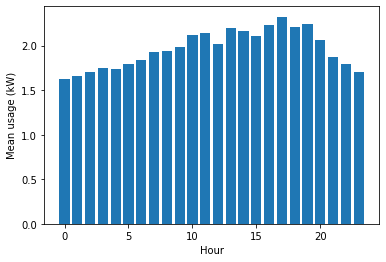
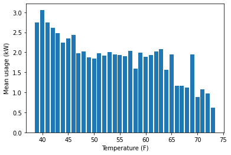
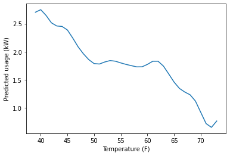
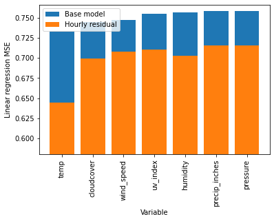
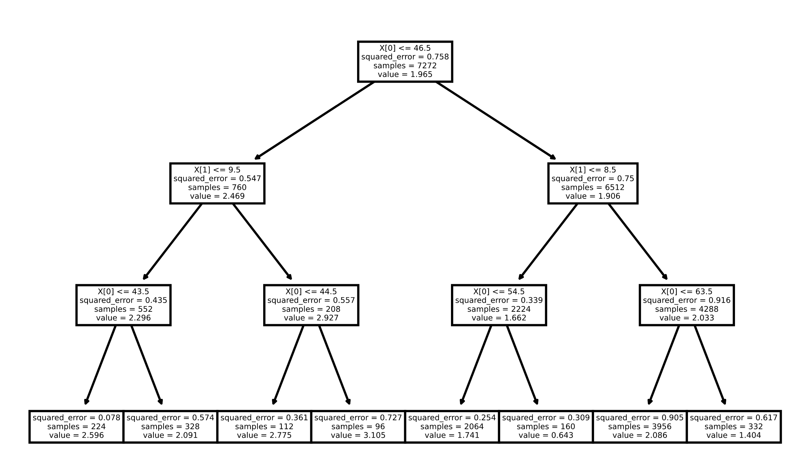

# weather-electric

My electric bill has been surprisingly high since moving to California a few months ago. Our apartment's daily power draw ranges from 25-50 kWh, which means our average usage is somewhere in the 1-2 kW range. It turns out that our heaters are electric, and I suspected them as the culprit. To test this hypothesis, I checked how well our power usage could be predicted using historical weather data, since outside temperature should determine how much the heaters need to be run.

**The tl;dr:** a linear model on temperature predicts that our power usage goes down by 0.048 kW for every degree Fahrenheit increase in the weather.

# Dumping the data

I used PG&E's website to download our historical hourly power usage data going back since we moved. This data comes in a machine-readable CSV format. For weather data, I tried out the API on [worldweatheronline.com](https://www.worldweatheronline.com). I used a free trial since I figured I'd only use this API once or twice over the course of a few days.

Using these data sources, I output a single CSV file with every hour of electric usage paired with various weather data for that time period (cloud cover, temperature, rain inches, etc.).

# Visualizing the data

Before jumping into the weather, let's look at a much more boring variable: time. I expected our electric usage to correlate strongly with time of day, especially since the temperature outside fluctuates heavily with time. Here I've plotted the average usage rate for every hour in the day (using 24-hour time):



We can see that usage is higher in the middle of the day and lower at night, as expected.

Now let's look at power usage as a function of temperature. We can start by averaging the usage for every degree Fahrenheit:



There is clearly a downward trend here, but it is not quite linear. We can get a smooth fit for this curve using Support Vector Regression:



# Empirical errors

Up until now, we've been looking at plots. But what we've really been doing is creating models that predict electric usage. We can evaluate a model using the mean squared error between predicted and actual temperatures.

If we simply predict the mean temperature usage, the mean squared error is `0.7583`. This is also just the variance of the usage variable. If we look back at our hourly model, the mean squared error is `0.7150`. For our SVR fit of per-temperature electric usage, mean squared error is `0.7254`.

Now let's look at mean squared error when using linear regression on various weather variables. In addition to regular linear regression, we can also learn "residual" models that are stacked on top of the hourly prediction model. These are shown in orange:



As we can see, stacking the weather model on top of the hourly model is always helpful. We get the lowest mean squared error using temperature, which seems like a good sign.

What do these linear models look like? The temperature-based model has one coefficient, and this ends up being `-0.047868`. This means that mean usage decreases by 0.047868 kW per degree increase in weather temperature. This model has mean squared error `0.6444`.

We can also train a weather model on all of the variables at once. The MSE for this model comes out to `0.6332`, and the coefficients are:

```python
[
    ('temp', -0.052709073411816375),
    ('cloudcover', 0.002301869330723216),
    ('wind_speed', 0.006908816742465738),
    ('precip_inches', -1.5579171680815023),
    ('humidity', -0.00259181612440007),
    ('pressure', 0.0),
    ('uv_index', 0.047997568492231524),
]
```

# Unexplained variance

Our best model has an MSE of 0.6332, only explaining 16% of the total variance in power usage (0.7583).

This doesn't surprise me very much given our models' very limited information. For example, we periodically use appliances (e.g. a washing machine) that cause large spikes in hourly usage. These spikes can't be reliably predicted by time of day or any other variable our models have access to. As an additional note, the weather correlates with the season, and our habits might have changed in non-linear ways over our stay here.

# Misc: Decision tree

We can also try fitting a decision tree to this data. In particular, I trained a shallow tree using time and temperature as inputs. This model gets MSE `0.6431`. It ends up looking like this:

```python
if temp <= 46.5:
    if time <= 9:
        if temp <= 43:
            return 2.569
        else:
            return 2.091
    else:
        if temp <= 44:
            return 2.775
        else:
            return 3.105
else:
    if time <= 8:
        if temp <= 54:
            return 1.741
        else:
            return 0.643
    else:
        if temp <= 63:
            return 2.086
        else:
            return 1.404
```


